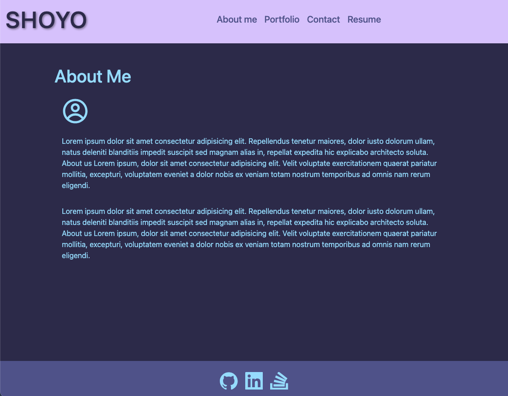
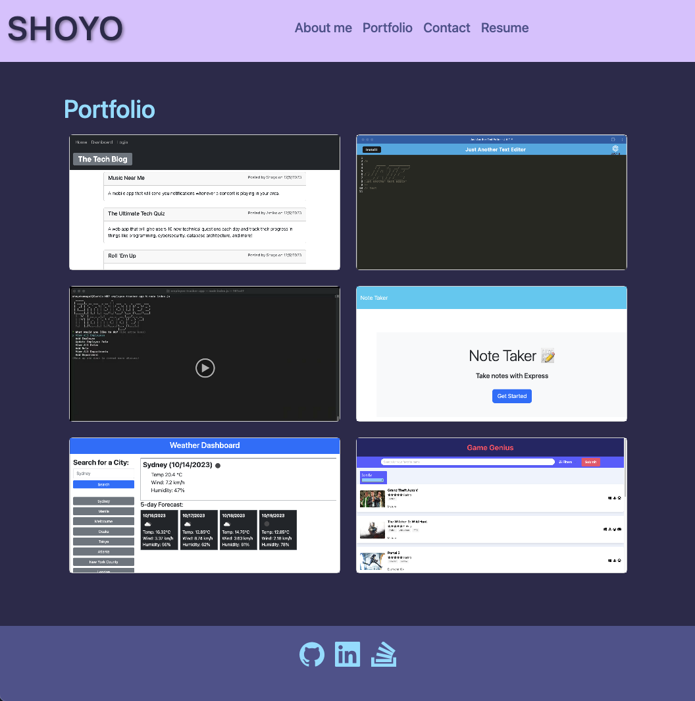
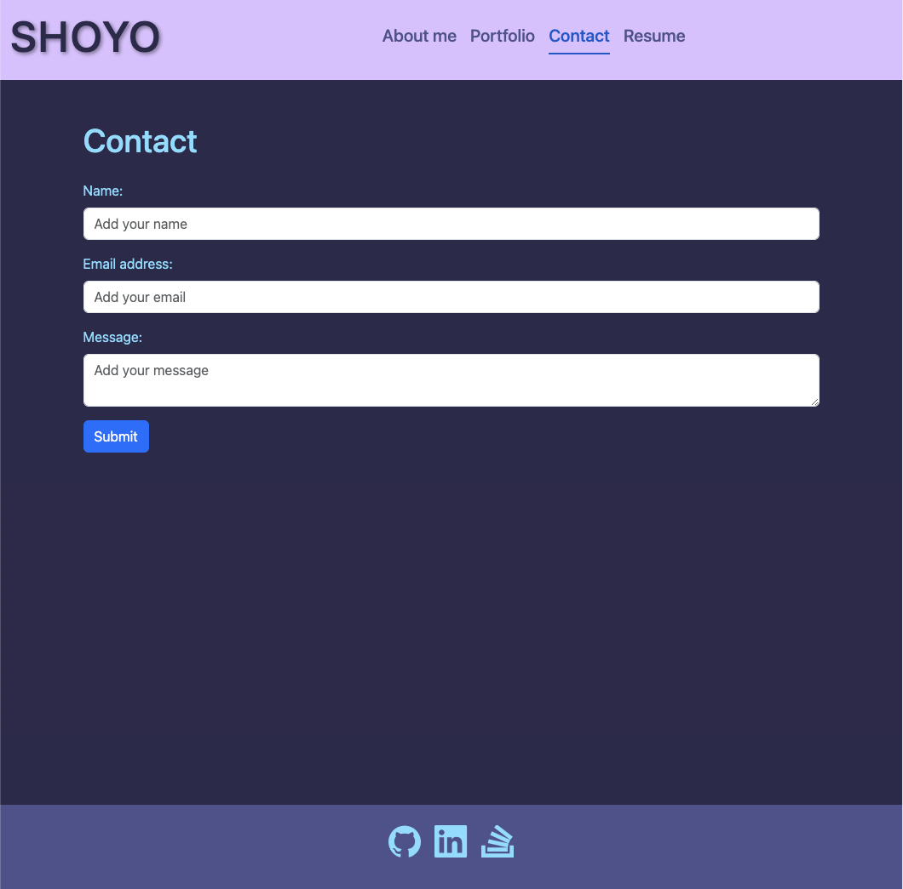
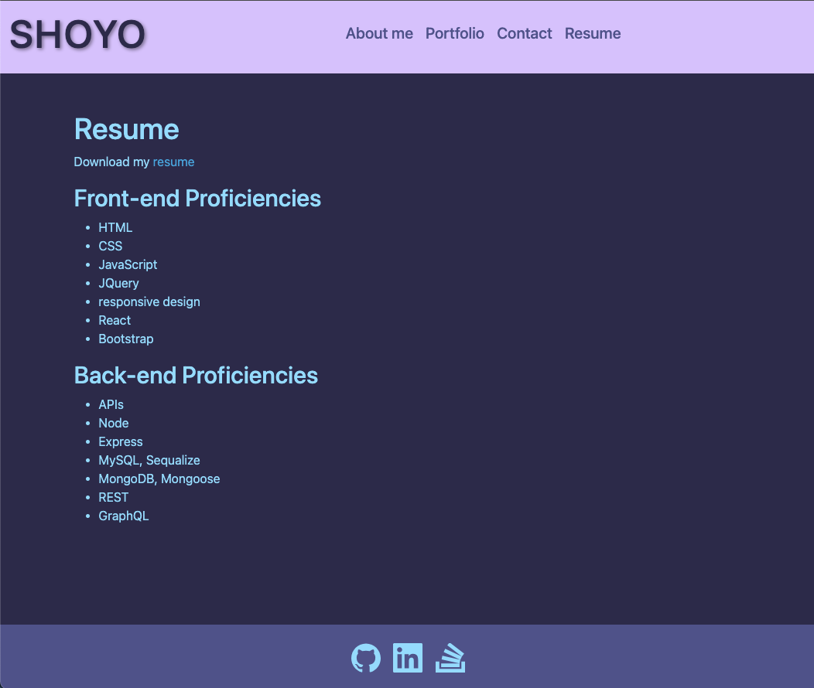

# Shoyo Portfolio

## Description

This website is a collection of my personal projects that showcase the things I have learned throughout my web dev journey.

## Table of Contents

- [Screenshots](#screenshots)
- [Installation Guide](#installation)
- [Usage](#usage)
- [Credits](#credits)
- [License](#license)

## Screenshots

**About me page**


**Portfolio page**


**Contact page**


**Resume page**


## Installation

- Install independencies

```bash
npm i
```

- Run application

```bash
npm run start
```

## Usage

- Display and showcase your projects
- Page for collecting contact information
- Display your resume and link
- Advertise your projects

## Credits

The underlying technologies used in this Portfolio website is React, and Bootstrap

- [React](https://legacy.reactjs.org/docs/getting-started.html)
- [Bootstrap](https://getbootstrap.com/docs/5.3/getting-started/introduction/)

## License

This project is licensed under the MIT License.

## Link to Deployed Application

- [Render deployed application](https://react-portfolio-o1fe.onrender.com)
